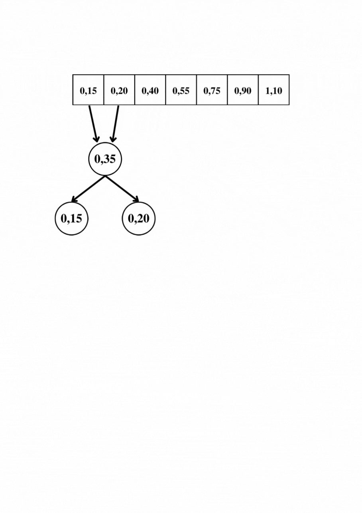

# Huffman-Tree

<h2> <u>Compressão de arquivos por Árvore de Huffman</u>

---

## Problema

Elabore uma árvore binária que utilize o código de Huffman para comprimir arquivos. Para tanto, (1) contabilizar a recorrência de cada palavra (RP) no arquivo; (2) normalizar a contabilização entre 0 e 1 utilizando a formula -> RP / (max(RP) - min(RP)); (3) Montar a árvore com as regras apresentadas por Huffman; (4) Troque as palavras pela codificação binária (utilizar booleano para representar 0 e 1); (5) Salve o arquivo em formato binário e observe qual foi o ganho de espaço obtido.

---

## Lógica

### Introdução

Dentre as linguagens oferecidas para a resolução do problema (C e C++), para este utilizou-se a linguagem C++, pois facilita a manipulação de arquivos e strings.
Para a resolução do problema era necessário a implementação de um arquivo texto para ser comprimido, para isto, utilizou-se de um dos documentos fornecidos pelo Professor em um trabalho anterior. E para a criação e implementação da árvore binária adaptou-se-se o código, também fornecido pelo professor, <a href = "https://github.com/mpiress/basic_tree">basic tree</a>.

### Funções reutilizadas do trabalho TF-IDF

Com a necessidade de tratar strings em leituras de arquivo texto, foi possível reutilizar e adaptar funções feitas no trabalho <a href="https://github.com/TFIDF-Project/tfidf-algorithm">TF-IDF</a>. E estas são: 

### Função string_treatment()

Esta função recebe como parâmetro uma variável tipo <i>string</i> e remove quaisquer caracteres não-alfanuméricos da mesma, retornando-a limpa.

### Função trataArquivo()

Tendo a necessidade de comprimir um arquivo texto, essa função tem o trabalho de: fazer a primeira leitura do texto e contabilizar a quantidade de vezes que cada palavra do texto repete. Para realizar o ato de armazenar as palavras e acessá-las posteriormente, utilizou-se o <a href="https://cplusplus.com/reference/unordered_map/unordered_map/">unordered_map</a>, um mapa desordenado do tipo <i><b>Hash</i></b>.

---

### Funções próprias do trabalho

### Função verificaMapa()

Recebe o mapa anteriormente preenchido e a chave a ser pesquisada, que no caso deste trabalho é a própria palavra. Se a palavra existir no mapa, retorna-se <i>True</i> e soma +1 na contagem de repetição daquela, concluindo assim o item (1) do enunciado.

### Função normalizaMapa()

O item (2) pede que seja feito uma normalização da contagem de palavras e esta função, juntamente da <code>calculaRP</code>, recebe o mapa preenchido e retorna a contagem de palavras, agora com valores entre 0 e 1.

### Função calculaRP()

Recebe o contador da palavra junto da palavra que mais se repete e a que menos se repete, fazendo o cálculo pedido <b>RP / (max(RP) - min(RP))</b>. Concluindo o item(2).

### Função fazFloresta()

Aqui começa a aplicação do código de Huffman, para isto, criou-se um <i>vector</i> do tipo <i>Tree</i>, ou seja, em cada posição deste vetor terá uma árvore armazenada. Com este vetor em mãos, a aplicação da árvore começa ordenando-o crescentemente de acordo com o valor de repetição normalizado <i>normalizedRP</i>.

Com o vetor ordenado começa-se a somar os dois menores <i>normalizedRP</i> presentes no mesmo, a soma resultante se tornará um novo <i>nó</i> e será reenserido no vetor, os dois nós somados se tornarão filhos do nó-soma e excluídos do vetor para que o processo se repita até que sobre apenas uma posição no vetor.

### Função sortTree()

Para que o vetor citado na função anterior seja ordenado, criou-se esta função, que recebe o vetor após a inserção de um novo nó-soma e retorna o mesmo completamente ordenado.

### Função widthPath()

Esta função pode ser explicada como uma adaptação do algoritmo de caminhamento <a href = "https://en.wikipedia.org/wiki/Breadth-first_search"> BFS</a>, percorrendo todos os vértices em largura. Para a implementação do código de Huffman utilizou-se deste método para inserir o valor binário de cada palavra na árvore. Ao andar para a esquerda insere 0 e para a direita 1. Com a árvore implementada e os vértices com seus devidos valores, os item (3) e (4) estão concluídos.

### Função writeBinFile()

Para concluir o trabalho é necessário transformar as palavras do texto em suas respectivas representações binárias, para isso, criou-se outro <code>unordered_map</code> que terá como chave a palavra do texto e o conteúdo será seu respectivo número binário, para isso, na função <code>widthPath</code> os valores binários atribuídos são concatenados e inseridos diretamente na posição da palavra atual no mapa.

Fazendo a releitura do arquivo texto, a cada palavra lida, a função irá inserir em um segundo arquivo criado, agora binário, a sua representação binária.

### Função stringToBoolVector()

Para reduzir o tamanho em mémoria do conteúdo inserido no arquivo, essa função recebe a representação binária no tipo <i>string</i> e retorna a mesma separada caractere por caractere em um <i>vector</i> do tipo <code>Booleano</code>.

Com a inserção das representações binárias em um arquivo binário, conclui-se o último item do enunciado.

Segue um exemplo de aplicação, o ganho de espaço neste exemplo foi de 16%.

---

## Exemplo

### Entrada:

Como a entrada possui diversas linhas, foi feito um upload para o acesso da mesma: <a href = "https://file.io/3SQV02nUcS11">entrada</a>

### Saída

Com a entrada dada, o programa gerará um arquivo binário de tamanho menor:

---

# Compilação e Execução

O exercício disponibilizado possui um arquivo Makefile cedido pelo professor que realiza todo o procedimento de compilação e execução. Para tanto, temos as seguintes diretrizes de execução:

| Comando                |  Função                                                                                           |                     
| -----------------------| ------------------------------------------------------------------------------------------------- |
|  `make clean`          | Apaga a última compilação realizada contida na pasta build                                        |
|  `make`                | Executa a compilação do programa utilizando o gcc, e o resultado vai para a pasta build           |
|  `make run`            | Executa o programa da pasta build após a realização da compilação                                 |

É recomendado fazer um <code>make clean</code> antes de um <code>make</code>.

